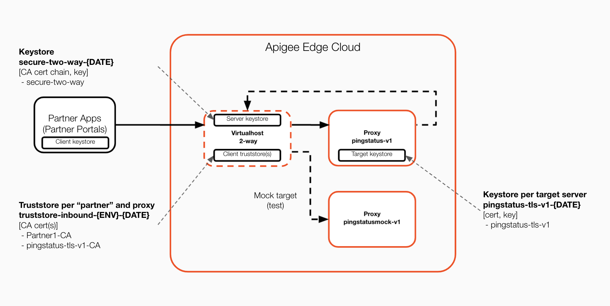
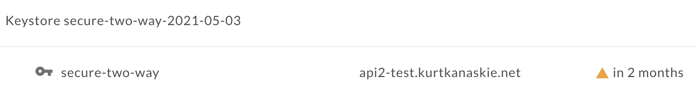
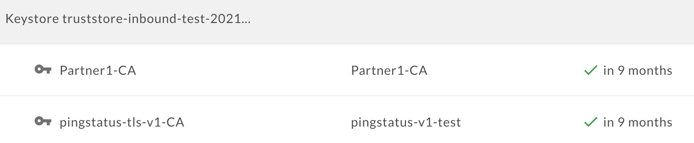
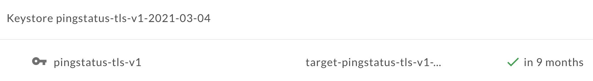

# Ping and Status with Mutual TLS

## Disclaimer

This example is not an official Google product, nor is it part of an official Google product.

## License

This material is copyright 2019, Google LLC. and is licensed under the Apache 2.0 license.
See the [LICENSE](LICENSE) file included.

This code is open source.

## Overview
This POC uses a mTLS virtual host with the "pingstatus-tls-v1" proxy. The proxy uses a mTLS configured Target Server (pingstatus-tls-v1) that connects to a mock proxy "pingstatus-tls-v1-mock". The response includes TLS information from both the proxy and the mock proxy.

### Solution
This POC demonstrates the use of a static API proxy mock with mutual TLS configured for both client-to-edge (pingstatus-tls-v1) and edge-to-target (pingstatus-tls-v1-mock).


### Prerequisites
Install the mock API proxy, it can be imported from [pingstatus-tls-v1-mock.zip](pingstatus-tls-v1-mock.zip).

Obtain certificates for your Virtual Host and create certificates for self-signed certificate authority (CA).

Configure the virtual host, keystores, trustore and associated references.
* Virtual host configured with mTLS (e.g. secure-two-way)
  * Keystore (cert chain, key) for virtual host (e.g. secure-two-way-YYYY-MM-DD with secure-two-way alias)
  
  * Truststore (CA cert) for virtual host (e.g. truststore-inbound-test-YYYY) with aliases for each trusted client (e.g. Partner1-CA, Partner2-CA) including the target server (pingstatus-tls-v1-CA)
  
  * References
    * ref://truststore-inbound-test --> truststore-inbound-test-YYYY
    * ref://secure-two-way --> secure-two-way-YYYY-MM-DD
  * Virtual Host Definition
```
{
  "baseUrl": "",
  "description": "",
  "hostAliases": [
    "api2-test.kurtkanaskie.net"
  ],
  "interfaces": [],
  "listenOptions": [],
  "name": "secure-two-way",
  "port": "443",
  "propagateTLSInformation": {
    "clientProperties": true,
    "connectionProperties": true
  },
  "retryOptions": [],
  "sSLInfo": {
    "ciphers": [],
    "clientAuthEnabled": "true",
    "enabled": "true",
    "ignoreValidationErrors": false,
    "keyAlias": "secure-two-way",
    "keyStore": "ref://secure-two-way",
    "protocols": [],
    "trustStore": "ref://truststore-inbound-test"
  },
  "useBuiltInFreeTrialCert": false
}
```

* Target Server (pingstatus-tls-v1) 
  * Keystore for target server (e.g. pingstatus-tls-v1-YYYY-MM-DD with pingstatus-tls-v1 alias)
  
  * References
    * ref://pingstatus-tls-v1 --> pingstatus-tls-v1-YYYY-MM-DD

### Request and Response
Partner 1 - Client 1
```
curl -s https://api2-test.kurtkanaskie.net/pingstatus-tls/v1/status --header "X-APIKey: $APIKEY_1" --cert test/integration/certs/partner1-client1.crt --key test/integration/certs/partner1-client1.key
{
  "environment": "test",
  "apiproxy": "pingstatus-tls-v1",
  "basepath": "/pingstatus-tls/v1",
  "suffix": "/status",
  "client": "64.121.12.38",
  "time": "Thu, 3 Jun 2021 15:17:39 UTC",
  "proxyLatency": 18,
  "targetLatency": 22,
  "latency": 40,
  "client.cn": "Partner1-Client1",
  "client.country": "US",
  "client.email.address": "",
  "client.locality": "Macungie",
  "client.organization": "Partner1",
  "client.organization.unit": "IT Security",
  "client.ssl.enabled": "true",
  "client.state": "PA",
  "message": "STATUS",
  "backendHeaders": {
    "X-Client-Server-Name": "api2-test.kurtkanaskie.net",
    "X-Client-Session-ID": "18294607b5ee5a8a3c973eb13aadb6ff63e7d349715b660e71cc04688dd80d5b",
    "X-Client-CN": "Partner1-Client1",
    "X-Client-S-DN": "CN=Partner1-Client1",
    "X-Client-I-DN": "CN=Partner1-CA"
  },
  "backendMessage": {
    "path": "/status",
    "uri": "https://api2-test.kurtkanaskie.net/pingstatus-tls-mock/v1/status",
    "clientHost": "35.231.238.30",
    "clientDN": "target-pingstatus-tls-v1-test",
    "tls.cipher": "ECDHE-RSA-AES256-GCM-SHA384",
    "tls.protocol": "TLSv1.2",
    "tls.server.name": "api2-test.kurtkanaskie.net",
    "tls.session.id": "101e6523a7a9ea5c842e4cf4eb21d6dfe35e3ada354f81f2e7bc24291398ed89",
    "tls.client.s.dn": "CN=target-pingstatus-tls-v1-test,OU=IT Security,O=Apigee,L=Macungie,ST=PA,C=US",
    "tls.client.i.dn": "emailAddress=kurtkanaskie@google.com,CN=pingstatus-v1-test,OU=IT,O=Google,L=Macungie,ST=PA,C=US",
    "tls.client.raw.cert": "-----BEGIN CERTIFICATE-----\nMIIDi...e5msBDH\n-----END CERTIFICATE-----\n",
    "tls.client.cert.serial": "991AFF257C7C13E9",
    "tls.client.cert.fingerprint": "593e8ffbbcf5df00f109db9fc7caf073d2f568ad",
    "client.cn": "target-pingstatus-tls-v1-test",
    "client.country": "US",
    "client.email.address": "",
    "client.locality": "Macungie",
    "client.organization": "Apigee",
    "client.organization.unit": "IT Security",
    "client.ssl.enabled": "true",
    "client.state": "PA",
    "status": "OK"
  }
}
```
Partner 1 - Client 2
```
curl -s https://api2-test.kurtkanaskie.net/pingstatus-tls/v1/status --header "X-APIKey: $APIKEY_2" --cert test/integration/certs/partner1-client2.crt --key test/integration/certs/partner1-client2.key
{
  "environment": "test",
  "apiproxy": "pingstatus-tls-v1",
  "basepath": "/pingstatus-tls/v1",
  "suffix": "/status",
  "client": "64.121.12.38",
  "time": "Thu, 3 Jun 2021 15:25:54 UTC",
  "proxyLatency": 60,
  "targetLatency": 10,
  "latency": 70,
  "client.cn": "Partner1-Client2",
  "client.country": "US",
  "client.email.address": "",
  "client.locality": "Macungie",
  "client.organization": "Partner1",
  "client.organization.unit": "IT Security",
  "client.ssl.enabled": "true",
  "client.state": "PA",
  "message": "STATUS",
  "backendHeaders": {
    "X-Client-Server-Name": "api2-test.kurtkanaskie.net",
    "X-Client-Session-ID": "ef2019a34a1e39a9715ce2485363d98ec5d43cf10159984a07b309b64a5d23f8",
    "X-Client-CN": "Partner1-Client2",
    "X-Client-S-DN": "CN=Partner1-Client2",
    "X-Client-I-DN": "CN=Partner1-CA"
  },
  "backendMessage": {
    "path": "/status",
    "uri": "https://api2-test.kurtkanaskie.net/pingstatus-tls-mock/v1/status",
    "clientHost": "35.231.238.30",
    "clientDN": "target-pingstatus-tls-v1-test",
    "tls.cipher": "ECDHE-RSA-AES256-GCM-SHA384",
    "tls.protocol": "TLSv1.2",
    "tls.server.name": "api2-test.kurtkanaskie.net",
    "tls.session.id": "101e6523a7a9ea5c842e4cf4eb21d6dfe35e3ada354f81f2e7bc24291398ed89",
    "tls.client.s.dn": "CN=target-pingstatus-tls-v1-test,OU=IT Security,O=Apigee,L=Macungie,ST=PA,C=US",
    "tls.client.i.dn": "emailAddress=kurtkanaskie@google.com,CN=pingstatus-v1-test,OU=IT,O=Google,L=Macungie,ST=PA,C=US",
    "tls.client.raw.cert": "-----BEGIN CERTIFICATE-----\nMIID...aCqsBDH\n-----END CERTIFICATE-----\n",
    "tls.client.cert.serial": "991AFF257C7C13E9",
    "tls.client.cert.fingerprint": "593e8ffbbcf5df00f109db9fc7caf073d2f568ad",
    "client.cn": "target-pingstatus-tls-v1-test",
    "client.country": "US",
    "client.email.address": "",
    "client.locality": "Macungie",
    "client.organization": "Apigee",
    "client.organization.unit": "IT Security",
    "client.ssl.enabled": "true",
    "client.state": "PA",
    "status": "OK"
  }
}
```

## Installation
This CI/CD solution is based off the pingstatus-v1 example, please see details [here](https://github.com/kurtkanaskie/pingstatus-v1).

### Install and test
All at once
* mvn -P test-two-way install -Ddeployment.suffix= -Dapigee.config.options=update -Dapigee.config.dir=target/resources/edge -Dapigee.config.exportDir=target/test/integration -Dapi.testtag=@health

Process resoureces and run integration tests
* mvn -P test-two-way process-resources apigee-config:exportAppKeys frontend:npm@integration -Ddeployment.suffix= -Dskip.clean=true -Dapigee.config.dir=target/resources/edge -Dapigee.config.exportDir=target/test/integration -Dapi.testtag=@health

Just re-run integration tests from target
* mvn -P test-two-way exec:exec@integration -Dskip.clean=true -Dapigee.config.dir=target/resources/edge 
* npm run integration
